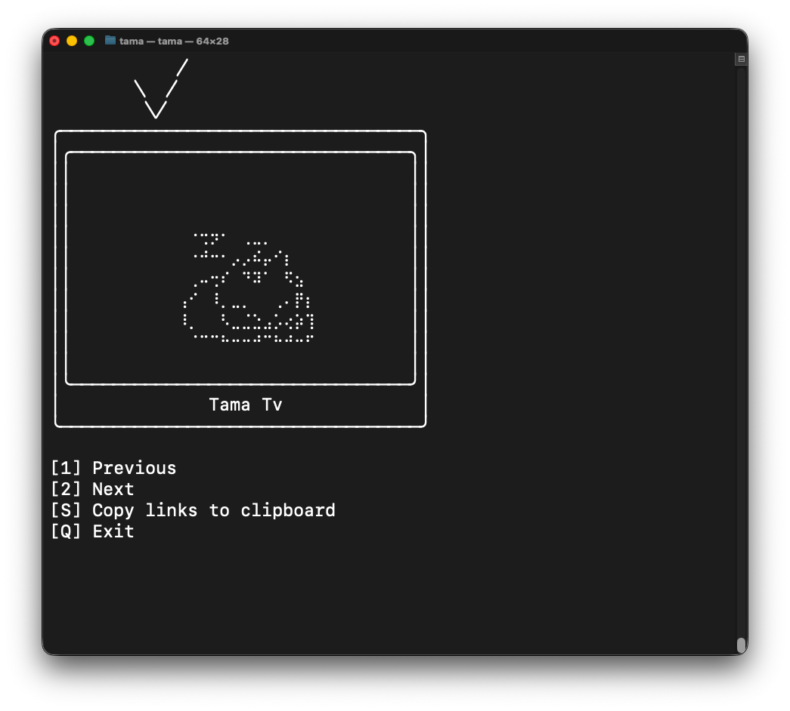
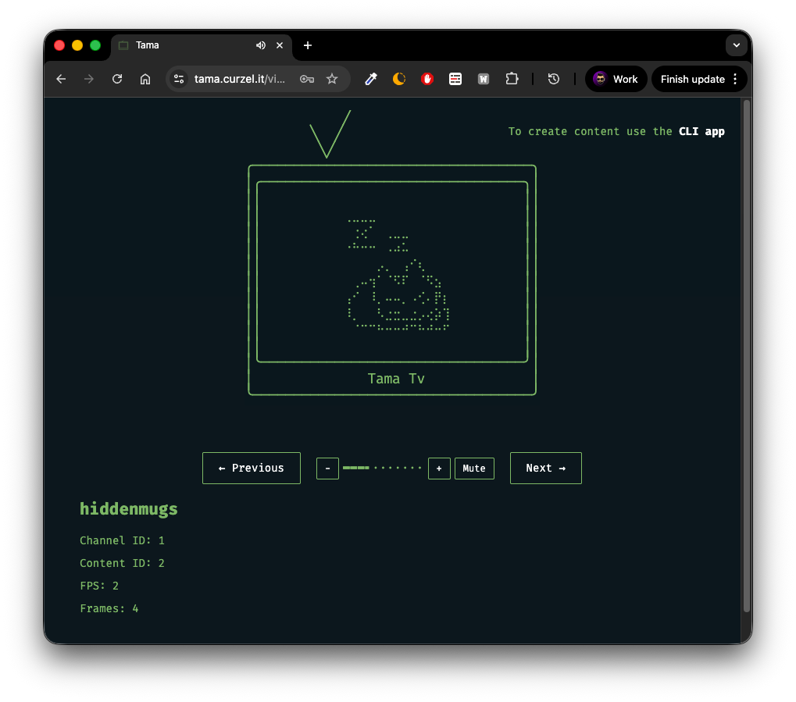
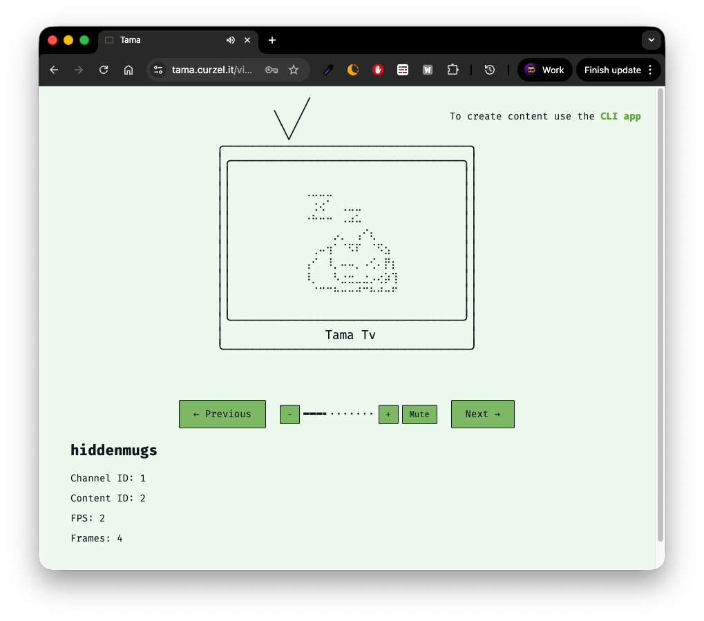

# Tama

Ascii art, retro vibes, and MIDI music in your command line, in _glorious_ 64 x 40 resolution!



Also working on a [web version](https://tama.curzel.it):




## Quick Start
See [sprites/neko_idle.txt](sprites/neko_idle.txt) for an example of content format.

```bash
# Watch the Feed
cargo run --bin tama

# Login / Signup
cargo run --bin tama auth

# Preview local content
cargo run --bin tama preview sprites/neko_idle.txt

# Upload content
cargo run --bin tama upload sprites/neko_idle.txt

# Convert pixel art to ASCII
cargo run --bin ascii_art_converter -- sprite \
    -i sprites/neko.png \
    -o sprites/neko_idle.txt \
    --sprite-width 40 \
    --sprite-height 40

# Midi player
cargo run --bin midi_composer
```

## Bring your own server
The app automatically creates a `config.json` like this:
```json
{
  "server_url": "https://tama.curzel.it",
  "servers": [],
  "server_override": false
}
```
In short:
* Tama server implements a `GET /servers` endpoint
* The app calls that endpoint at launch to get a list of others servers it can download content from, which is saved in `servers`
* `server_override` allows users to skip the call to `GET /servers` and use a completely custom list

```json
{
  "server_url": "http://localhost:3000",
  "servers": [
    "http://localhost:3000",
    "http://localhost:3001"
  ],
  "server_override": true
}
```

So yeah, you can spin up your own server if you want, and we can just add it to the index... _Et voilà, dollar-store federation!_

## More docs
- [ASCII Art Animations](docs/ascii_art_sheets.md) - How to create and use ASCII art animations
- [MIDI Composer](docs/midi_composer.md) - Complete guide to the MIDI composer with examples

## Credits
Hope it's cool if I borrowed the [Neko](https://en.wikipedia.org/wiki/Neko_(software)) character!